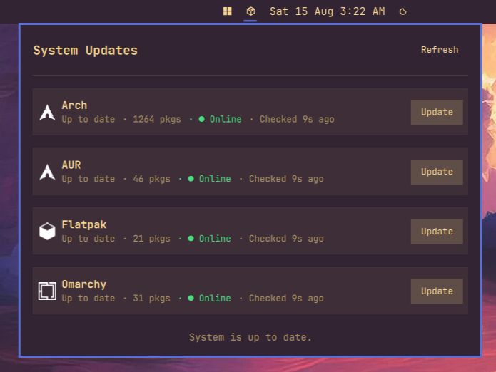

# dizziee.system-updates

System update indicator for the Omarchy bar. Shows available updates from pacman, AUR, and Flatpak, with per-repo update buttons.

## Requirements

- `checkupdates` (from `pacman-contrib`)
- AUR helper (`yay`, `paru`, etc.) — optional, AUR detection is automatic
- `flatpak` — optional

## Installation

```sh
omarchy plugin add https://github.com/JJDizz1L/dizziee.system-updates.git --enable
```

### Then place it in your bar layout with 
`omarchy bar plugin add dizziee.system-updates [--section <left|center|right>]`</br>

Suggested placement: 
```
omarchy bar plugin add dizziee.system-updates --section center
```

You can validate the plugin at any time with:

```sh
omarchy plugin validate ~/.config/omarchy/plugins/dizziee.system-updates
```

## Configuration
Configuration lives in `~/.config/omarchy/shell.json`.

| Key | Type | Default | Description |
|---|---|---|---|
| `refreshIntervalSec` | integer (300–7200) | 1800 | How often to check for updates (seconds) |
| `alwaysShow` | boolean | false | Keep icon visible even when no updates are available |

## Preview



## Uninstall

```sh
omarchy plugin remove dizziee.system-updates
```

## License

MIT
